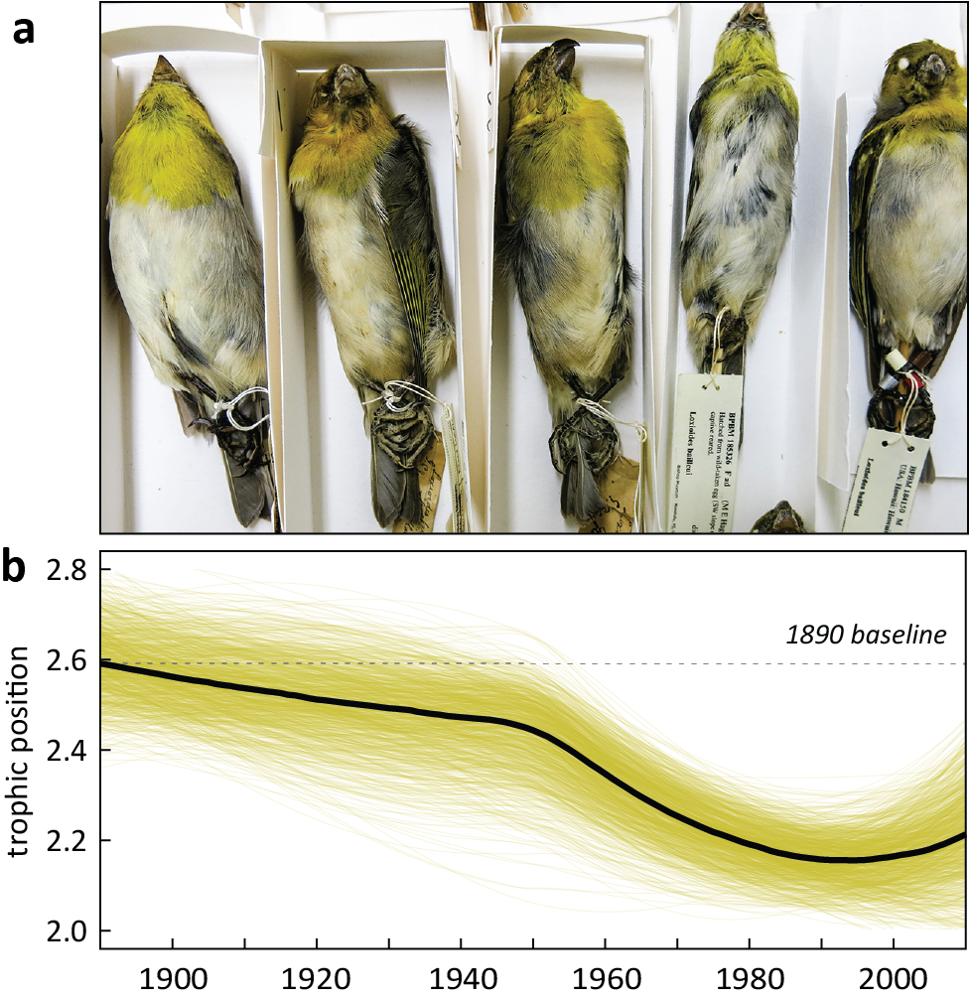

# palila_CSIA

**A century of trophic change in the palila (*Loxioides bailleui*), reconstructed from museum-specimen amino-acid stable isotopes**

<p align="center">
  
</p>

[](https://doi.org/10.1016/j.biocon.2024.110823)
[](https://osf.io/2jvs9/)
[](LICENSE)
[](https://www.r-project.org/)

Data, model, and code behind *Climatic drought and trophic disruption in an endemic
subalpine Hawaiian forest bird* (Van Houtan et al. 2024, *Biological Conservation*).
The project uses compound-specific stable isotope analysis of amino-acid δ¹⁵N
(CSIA-AA) on archived feathers and contemporary forage to reconstruct the long-term
diet and trophic position of the palila — a critically endangered Hawaiian
honeycreeper of the subalpine māmane (*Sophora chrysophylla*) forest on Mauna Kea.

Key findings: across 1891–2006 the palila trophic position fell from ~2.6 to ~2.2.
Bayesian mixing models attribute this to a dietary shift away from native moth
caterpillars (69.3% → 16.6% of diet, a 76% decline) toward native plants (30.7% →
83.4%, a 172% increase). Exploratory Bayesian regression points to rising surface
temperature — and its interactions with drought and caterpillar parasitism — as the
leading driver of the trophic decline.

---

## About this project

*(adapted and expanded from the original repository notes)*

The palila is an endemic Hawaiian land bird that resides only on the upper slopes of a
single volcano (Mauna Kea) on the island of Hawaiʻi. It is critically endangered and
actively declining in both abundance and geographic range. This project asks how
dietary and environmental factors contribute to that decline, and whether practical
management guidance follows. Specifically, it documents change in palila trophic level
(TL) from the late 1800s to the present, establishes the TL of the commonest palila
forage items, infers dietary shifts over time from the two, and examines the
environmental factors that might explain those shifts.

The project was initiated in 2018 as a collaboration among the Monterey Bay Aquarium
(Van Houtan, Gagné), the U.S. Geological Survey (Banko, Peck), the Bernice Pauahi
Bishop Museum (Hagemann), and UC Davis (Yarnes), and builds on the Ocean Memory Lab
model developed at the Monterey Bay Aquarium, where the majority of specimen
preparation and analysis was carried out. The original code was drafted by Tyler Gagné
at the Monterey Bay Aquarium (2017–2019) and later revised and substantially expanded
by Van Houtan (2022–2024) with new methods, datasets, and visualizations.

---

## Citation

If you use this code or data, please cite the paper.

> Van Houtan KS, Gagné TO, Banko P, Hagemann ME, Peck RW, Yarnes CT. 2024. Climatic
> drought and trophic disruption in an endemic subalpine Hawaiian forest bird.
> *Biological Conservation* 299:110823. https://doi.org/10.1016/j.biocon.2024.110823

<details>
<summary>BibTeX</summary>

```bibtex
@article{vanhoutan2024palila,
  title   = {Climatic drought and trophic disruption in an endemic subalpine
             Hawaiian forest bird},
  author  = {Van Houtan, Kyle S. and Gagn{\'e}, Tyler O. and Banko, Paul and
             Hagemann, Molly E. and Peck, Robert W. and Yarnes, Christopher T.},
  journal = {Biological Conservation},
  volume  = {299},
  pages   = {110823},
  year    = {2024},
  doi     = {10.1016/j.biocon.2024.110823}
}
```
</details>

**Data availability.** Data and code are archived here on GitHub and mirrored on the
Open Science Framework at [osf.io/2jvs9](https://osf.io/2jvs9/).

---

## Repository structure

```
palila_CSIA/
├── data/
│   ├── palila_samples/    # palila feather CSIA-AA δ15N + specimen metadata
│   ├── palila_prey/       # forage-item CSIA-AA δ15N (producers, caterpillars, insects, spiders)
│   ├── mixing model/      # MixSIAR inputs: mixture, source, discrimination
│   ├── environ_covars/    # SPEI drought index + caterpillar parasitism series
│   └── archive/           # superseded copies of mixture/source/SPEI data
├── script/
│   ├── forage beta TLs.R    # β and TEF derivation (Fig 2)
│   ├── forage AAs comp.R     # prey TP + diet-prior bar (Fig 1e); writes source_data
│   ├── forage AAs density.R  # prey TP density (exploratory / supplement)
│   ├── pali mixing model.R   # MixSIAR diet reconstruction (Fig 4)
│   ├── TP drivers model.R     # palila TP trend (Fig 3) + Bayesian driver regression (Fig 5)
│   └── rxiv/                  # archived / exploratory scripts (not in the final pipeline)
├── MixSIAR_model.txt      # JAGS model written by MixSIAR (continuous-effect mixing model)
├── images/                # palila + prey photos; larvae.png / spider.png silhouettes
├── viz/                   # exported figure PDFs/PNGs (working drafts + finals)
├── header.png             # Figure 3 (palila TP decline) — used as the README banner
├── palila_CSIA.Rproj      # RStudio project (sets working dir to repo root)
├── LICENSE                # MIT
└── README.md
```

Scripts read data with **paths relative to the repository root** (e.g.
`read.csv('data/palila_prey/palila_prey.csv')`). Open `palila_CSIA.Rproj` in RStudio —
or `setwd()` to the repo root — before running anything. Script files contain spaces in
their names; quote them when sourcing (e.g. `source("script/forage beta TLs.R")`).

---

## The analysis pipeline

Unlike a flat set of independent scripts, these five run as a **dependency chain**: two
constants and two intermediate CSVs are produced upstream and consumed downstream.

1. **`forage beta TLs.R`** derives the two food-web-specific isotope constants from the
   forage data — the producer offset **β ≈ 1.52** (from the Glx–Lys amino-acid pairing,
   chosen because it is the most consistent between the N₂-fixing C₃ māmane and standard
   C₃ naio) and the **trophic enrichment factor TEF ≈ 7.44** (TEF ≈ 6.85 at trophic
   level 2, ≈ 8.02 at level 3). These values are then **hard-coded downstream** as
   `b = 1.5183`, `TEF = 7.4354`. *Builds published Fig 2.*
2. **`forage AAs comp.R`** uses those constants to estimate the trophic position of each
   forage group and writes the mixing-model **`source_data.csv`**; it also builds the
   observed diet-proportion prior bar. *Builds published Fig 1e (+ Fig 2 source/trophic
   AA densities).* `forage AAs density.R` is a near-duplicate exploratory variant of the
   prey-TP density (supplement).
3. **`TP drivers model.R`** computes palila trophic position from feather CSIA-AA,
   corrects for collection-month phenology (a linear model fit to the well-sampled 1991
   cohort, re-centered to June), builds the 1,000-run LOESS ensemble trend, and writes
   the mixing-model consumer input **`mixture_data3.csv`**. It then assembles the
   environmental covariates and fits the Bayesian driver regression. *Builds published
   Fig 3 (TP trend) and Fig 5 (driver marginal effects).*
4. **`pali mixing model.R`** runs the MixSIAR Bayesian mixing model on the source,
   mixture, and discrimination data to reconstruct diet composition through time.
   *Builds published Fig 4.*

| Script | Builds (published) | Role |
| --- | --- | --- |
| `forage beta TLs.R` | Fig 2 | Derive β and TEF; AA δ¹⁵N across trophic levels; TEF raincloud. |
| `forage AAs comp.R` | Fig 1e (+ Fig 2 panels) | Prey TP; diet-proportion prior; writes `source_data.csv`. |
| `forage AAs density.R` | Supplement | Exploratory prey-TP density (overlaps `comp.R`). |
| `TP drivers model.R` | Fig 3, Fig 5 | Palila TP trend (LOESS ensemble) + Bayesian regression of drivers; writes `mixture_data3.csv`; builds covariate series (Figs S1–S2, S4, S7). |
| `pali mixing model.R` | Fig 4 | MixSIAR diet reconstruction through time (+ plant:animal ratio, Fig S6). |

> **A note on figure numbers.** Several in-script comments use an earlier draft
> numbering (e.g. the TP-trend block is labeled "WHAT BECOMES FIGURE 1B"; the mixing
> model's stacked-area plot is labeled "Figure 3 in the main text"). The "Builds
> (published)" column maps each to the final *Biological Conservation* figures.
> Published Fig 1 (the conceptual food-web diagram) is composited from photographs and
> the diet-prior bar.

---

## Methods in brief

**Trophic position.** For each specimen, TP is estimated from trophic (Glx) and source
(Lys) amino-acid δ¹⁵N as

```
TP = ( δ15N_Glx − δ15N_Lys − β ) / TEF + 1
```

Uncertainty is propagated by parametric bootstrapping — drawing normal variates from
each amino acid's lab-reported (mean, sd): 1,000 draws per specimen for TP, 37 for the
β formulations, 500 for TEF. Palila TP variates are sampled 100 per year (to offset
uneven sampling across years), and a LOESS trend is re-fit 1,000 times to build a
robust ensemble median from 1890 to 2010.

**Diet reconstruction (MixSIAR).** `MixSIAR_model.txt` is the JAGS model written by
MixSIAR: a one-isotope (TP) mixing model with **year as a continuous effect**, species
as a random effect, and process-only error. Three source groups — producers
(māmane + naio), caterpillars (*Cydia* + foliar *Scotorythra*), and other insects +
spiders — are combined with a weakly informative Dirichlet prior tuned to the observed
contemporary diet (~79% producers, ~18% caterpillars, ~3% other). The committed script
runs `run = "short"`; the published analysis used 3 chains × 100,000 iterations (10,000
burn-in, thinned 50), with Gelman-Rubin confirming convergence.

**Driver regression (brms / Stan).** Palila TP is regressed on standardized surface
temperature (CRU 12-month rolling mean), a 36-month drought index (SPEI36), and a
caterpillar-parasitism series, plus the temperature×drought and drought×parasitism
interactions. The model uses a truncated-normal response (lower bound 1), regularizing
`normal(0, 1)` coefficient priors, 4 chains × 10,000 iterations, and is assessed with
highest-density intervals against a ROPE (region of practical equivalence). These
driver results are flagged as exploratory given the temporally clumped specimen record.

---

## Data dictionary

### `data/palila_samples/` — consumer (feather) data

| File | Rows | Contents |
| --- | --- | --- |
| `Palila_CSSIA_Dec20.csv` | 102 | **Primary** CSIA-AA δ¹⁵N for palila feathers (Dec 2020 run): `ucdavis_id`, `acession_id`, `spp`, `year`, `location`, `value` (ave/sd), and the Glx, Lys, Pro amino acids used downstream. |
| `Palila_CSSIA_Aug20.csv` | 100 | Earlier (Aug 2020) run with the fuller 11–amino-acid suite. |
| `Palila_specimens_feather_database.csv` / `…2.csv` | 50 | Specimen metadata: rack/vial, ID, date, source repository, catalog no., sex, age, prep, lat/lon, location, region, elevation, collector. |
| `palila_sample_metadata_MBA_UCDavis_IDs.txt` / `…2.txt` | — | Crosswalk between Monterey Bay Aquarium specimen IDs and UC Davis SIF internal IDs. |

### `data/palila_prey/` — source (forage) data

| File | Rows | Contents |
| --- | --- | --- |
| `palila_prey.csv` | 26 | Forage CSIA-AA δ¹⁵N: `ucdavis_id`, `spp`, `photo`, `TL`, `TLc`, `value` (ave/sd), 11 amino acids. Forage codes below. |

Forage / source codes: **MAMANE** = *Sophora chrysophylla* (māmane; N₂-fixing C₃
producer, TL 1); **NAIO** = *Myoporum sandwicense* (naio; standard C₃ producer, TL 1);
**CYDIA** = *Cydia* seed-feeding caterpillars (TL 2); **FOLCAT** = foliar *Scotorythra*
caterpillars (TL 2); **ARTHO** = various insects; **SPIDER** = various spiders (TL ~3).
The consumer is **PALI** = palila (*Loxioides bailleui*).

### `data/mixing model/` — MixSIAR inputs

| File | Rows | Contents |
| --- | --- | --- |
| `source_dataX.csv` | 3 | Source groups with `MeanTL`, `SDTL`, `n` (written from the prey-TP estimates). |
| `mixture_data3.csv` | 120 | Palila TP time series (`year`, `TL`, `sd`, `spp = PALI`) — the consumer input, written by `TP drivers model.R`. |
| `mixture_data_spp.csv` | 120 | PALI subset written at run time. |
| `discrimination_data.csv` | 2 | Trophic discrimination (fixed `MeanTL = 1`, `SDTL = 0`; the “+1” of the TP equation). |
| `rXiv/` | — | Archived mixing-model inputs. |

### `data/environ_covars/` — ecosystem drivers

| File | Rows | Contents |
| --- | --- | --- |
| `spei_-155.25_19.75.csv` | 1,380 | Standardized Precipitation-Evapotranspiration Index (CSIC SPEIbase), 1–48-month timescales, monthly from 1901; `SPEI36` (36-month) is used. |
| `wasps2.csv` | 1,450 | Caterpillar-parasitism rate time series (`year`, `parasitism`), the revised series from Banko & Peck. |

*(Surface temperature is fetched at run time from the CRU TS / CRUTEM gridded archive
for the N17.5 W157.5 cell — see the reproducibility notes.)* `data/archive/` holds
superseded copies of the mixture, source, and SPEI data.

---

## Requirements

- **R ≥ 4.2** (analyses were run on R 4.2.2, macOS)
- **JAGS ≥ 4.3** installed separately (required by `rjags`/`R2jags`/`MixSIAR`) — see
  [sourceforge.net/projects/mcmc-jags](https://sourceforge.net/projects/mcmc-jags/)
- A working **Stan toolchain** (pulled in by `brms`)
- The R packages below

```r
install.packages(c(
  # data wrangling
  "tidyverse", "dplyr", "tidyr", "data.table", "plyr", "reshape", "reshape2",
  "zoo", "lubridate", "itsmr",
  # visualization
  "ggplot2", "ggthemes", "ggbeeswarm", "ggrepel", "ggdist", "patchwork",
  "RColorBrewer", "colorspace", "scales", "forcats", "gridExtra", "ragg", "png",
  # modeling
  "MixSIAR", "rjags", "R2jags",        # mixing model (needs JAGS)
  "brms", "tidybayes", "modelr",       # Bayesian regression (needs Stan)
  "bayestestR", "bayesplot", "pdp"
))
```

---

## Reproducing the analysis

1. **Clone** the repository and install JAGS, the Stan toolchain, and the packages
   above.
   ```bash
   git clone https://github.com/vanhoutan/palila_CSIA.git
   cd palila_CSIA
   ```
2. **Open** `palila_CSIA.Rproj` in RStudio (sets the working directory to the repo
   root, which the relative data paths rely on).
3. **Run scripts in dependency order**, since two of them write CSVs the others read:
   `forage beta TLs.R` (constants) → `forage AAs comp.R` (writes `source_data.csv`) →
   `TP drivers model.R` (writes `mixture_data3.csv`) → `pali mixing model.R`. The
   β/TEF constants are already hard-coded downstream and the intermediate CSVs are
   committed, so each script can also run on the data as shipped.

### Reproducibility notes

- **GitHub link in the paper.** The published data-availability statement lists
  `bit.ly/3qW45Md` for the GitHub repository — but that short link resolves to a
  *different* repo (the Neotropical-parrots project). The canonical location for this
  project is `github.com/vanhoutan/palila_CSIA`; the OSF mirror (`osf.io/2jvs9`) is
  correct. Worth fixing in any erratum or future citation.
- **Absolute paths for the silhouettes.** `forage beta TLs.R` reads the larvae and
  spider PNGs by a hard-coded `/Users/kylevanhoutan/...` path. Repoint these to the
  repo-relative `images/` directory (the files are committed there) to render the Fig 2
  raincloud insets elsewhere.
- **Live external temperature feed.** `TP drivers model.R` downloads CRU temperature
  data from `crudata.uea.ac.uk` at run time; CRU has changed its file formatting before
  (the script carries commented-out fallbacks), so this step can break independently of
  the archived data and may need updating.
- **MixSIAR run length.** The committed mixing-model call uses `run = "short"` for quick
  iteration; reproduce the published posterior with the full run (3 chains × 100,000
  iterations, 10,000 burn-in, thin 50).
- **Stochastic steps.** The bootstraps, LOESS resampling, and MCMC are random; the
  committed scripts do not all set a global seed, so expect small run-to-run variation
  around the reported medians (the trends and credible intervals are robust to it).
- **Housekeeping.** A stray Excel lock file (`data/~$Palila_CSSIA.xlsx`) and a
  screenshot in `data/` can be removed; `script/rxiv/` holds exploratory code (xgboost,
  circular phenology, an older Bayesian regression) that is not part of the final
  pipeline.

---

## License

Code in this repository is released under the **MIT License** — see [`LICENSE`](LICENSE).
© 2026 Kyle Van Houtan. The data are additionally mirrored open-access on the Open
Science Framework ([osf.io/2jvs9](https://osf.io/2jvs9/)).

---

## Authors

- **Kyle S. Van Houtan** — conceptualization, analysis, code, figures (Nicholas School
  of the Environment, Duke University; Monterey Bay Aquarium) ·
  [@vanhoutan](https://github.com/vanhoutan) · *co-first author*
- **Tyler O. Gagné** — methodology, analysis, original code (Monterey Bay Aquarium) ·
  *co-first author*
- **Paul Banko** — project conception, field resources, data (USGS Pacific Island
  Ecosystems Research Center) · *corresponding author*
- **Molly E. Hagemann** — specimen resources and curation (Bernice Pauahi Bishop
  Museum)
- **Robert W. Peck** — field investigation and data (Hawaii Cooperative Studies Unit,
  University of Hawaiʻi at Hilo)
- **Christopher T. Yarnes** — CSIA-AA methodology and isotope analysis (Stable Isotope
  Facility, UC Davis)

Specimens were provided by the Bishop Museum, the USGS Pacific Island Ecosystems
Research Center, and the Museum of Vertebrate Zoology (UC Berkeley); research was
conducted under ESA permit TE 003483-6 and Hawaiʻi DLNR permit WL010-06, and supported
in part by a PECASE award to K. Van Houtan and the Monterey Bay Aquarium's Ocean Memory
Lab. See the paper's Acknowledgments for the full list of contributors.
